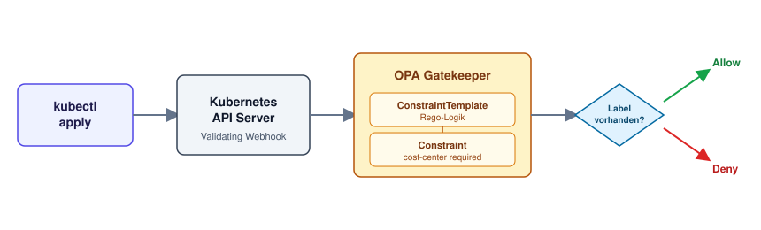

# OPA Gatekeeper: Policies durchsetzen, die Pod Security Admission nicht kann

Getestet gegen Kubernetes 1.36 (DOKS, DigitalOcean fra1).

Folge 3 der Serie **Kubernetes Sicherheit**. Pod Security Admission (Folge 2) prüft nur eine feste Liste von Security-Feldern — `runAsNonRoot`, Capabilities, Privileged und ein paar mehr. Für alles, was darüber hinausgeht — eigene Governance-Regeln wie Pflicht-Labels, erlaubte Registries, Namenskonventionen — ist bei PSA Schluss. OPA Gatekeeper schließt genau diese Lücke: beliebige Regeln, geschrieben in Rego, durchgesetzt über denselben Admission-Webhook-Mechanismus.



## Voraussetzungen

- Laufender Kubernetes-Cluster (DOKS oder jeder andere) mit `kubectl`-Zugriff
- `helm` installiert

## Überblick

```
Schritt 1: Gatekeeper per Helm installieren
Schritt 2: Zeigen, dass ohne Policy jeder Pod durchgeht
Schritt 3: ConstraintTemplate schreiben (Rego) — Pflicht-Labels
Schritt 4: Constraint erstellen — cost-center wird Pflicht
Schritt 5: Pod ohne Label deployen — abgelehnt
Schritt 6: Pod mit Label deployen — erlaubt
Schritt 7: Audit-Modus — Verstöße finden, ohne zu blockieren
Schritt 8: Aufräumen
```

---

## Schritt 1: Gatekeeper installieren

```bash
helm repo add gatekeeper https://open-policy-agent.github.io/gatekeeper/charts
helm repo update
helm install gatekeeper gatekeeper/gatekeeper \
  --namespace gatekeeper-system --create-namespace
```

Prüfen, ob alles läuft:

```bash
kubectl get pods -n gatekeeper-system
```

Drei bis fünf Pods (Controller-Manager + Audit) sollten `Running` sein, bevor es weitergeht.

## Schritt 2: Ohne Policy geht alles durch

```bash
kubectl create namespace gatekeeper-demo
kubectl run test-pod --image=nginx:alpine -n gatekeeper-demo
```

**Erwartete Ausgabe:**

```
pod/test-pod created
```

Kein Label, keine Einschränkung — Gatekeeper hat noch keine Regeln, die er durchsetzen könnte. Genau hier würde PSA (egal ob `baseline` oder `restricted`) nichts einwenden: Der Pod verletzt kein Security-Feld. Das Problem ist eine fehlende Governance-Regel, kein Security-Problem.

```bash
kubectl delete pod test-pod -n gatekeeper-demo
```

## Schritt 3: ConstraintTemplate — die Regel als Rego-Code

Ein `ConstraintTemplate` definiert eine wiederverwendbare Regel-Vorlage. Die eigentliche Logik steckt in Rego, der Policy-Sprache von OPA:

```yaml
# 01-constrainttemplate.yml
apiVersion: templates.gatekeeper.sh/v1
kind: ConstraintTemplate
metadata:
  name: k8srequiredlabels
spec:
  crd:
    spec:
      names:
        kind: K8sRequiredLabels
      validation:
        openAPIV3Schema:
          type: object
          properties:
            labels:
              type: array
              items:
                type: string
  targets:
    - target: admission.k8s.gatekeeper.sh
      rego: |
        package k8srequiredlabels

        violation[{"msg": msg}] {
          provided := {label | input.review.object.metadata.labels[label]}
          required := {label | label := input.parameters.labels[_]}
          missing := required - provided
          count(missing) > 0
          msg := sprintf("Pflicht-Label(s) fehlen: %v", [missing])
        }
```

```bash
kubectl apply -f 01-constrainttemplate.yml
```

Das Template allein tut noch nichts — es registriert nur einen neuen Constraint-Typ (`K8sRequiredLabels`) in der API. Durchgesetzt wird erst, wenn ein `Constraint`-Objekt davon Gebrauch macht.

## Schritt 4: Constraint — die Regel scharf schalten

```yaml
# 02-constraint.yml
apiVersion: constraints.gatekeeper.sh/v1beta1
kind: K8sRequiredLabels
metadata:
  name: require-cost-center
spec:
  enforcementAction: deny
  match:
    kinds:
      - apiGroups: [""]
        kinds: ["Pod"]
    namespaces: ["gatekeeper-demo"]
  parameters:
    labels: ["cost-center"]
```

```bash
kubectl apply -f 02-constraint.yml
```

Ab jetzt gilt: Jeder Pod im Namespace `gatekeeper-demo` braucht das Label `cost-center` — sonst greift der Admission-Webhook.

## Schritt 5: Pod ohne Label — abgelehnt

```bash
kubectl run blocked-pod --image=nginx:alpine -n gatekeeper-demo
```

**Erwartete Ausgabe:**

```
Error from server (Forbidden): admission webhook "validation.gatekeeper.sh" denied the request: [require-cost-center] Pflicht-Label(s) fehlen: {"cost-center"}
```

Der Request kommt nie im Cluster an — abgelehnt, bevor etcd ihn je gesehen hat.

## Schritt 6: Pod mit Label — erlaubt

```bash
kubectl run allowed-pod --image=nginx:alpine -n gatekeeper-demo \
  --labels="cost-center=team-platform"
```

**Erwartete Ausgabe:**

```
pod/allowed-pod created
```

## Schritt 7: Audit-Modus — erst beobachten, dann blockieren

In der Praxis schaltest du eine neue Regel selten sofort scharf — zu groß das Risiko, produktive Deployments zu blockieren, die niemand auf dem Schirm hatte. Mit `enforcementAction: dryrun` findet Gatekeeper Verstöße, ohne etwas abzulehnen:

```bash
kubectl patch k8srequiredlabels require-cost-center --type=merge \
  -p '{"spec":{"enforcementAction":"dryrun"}}'
```

Im `dryrun`-Modus lässt Gatekeeper Pods ohne Label jetzt durch — protokolliert den Verstoß aber:

```bash
kubectl run audit-me --image=nginx:alpine -n gatekeeper-demo
```

Der Audit-Controller läuft standardmäßig alle 60 Sekunden. Kurz warten, dann den Report abrufen:

```bash
kubectl get k8srequiredlabels require-cost-center -o jsonpath='{.status.violations}' | jq .
```

**Erwartete Ausgabe:**

```json
[
  {
    "enforcementAction": "dryrun",
    "group": "",
    "kind": "Pod",
    "message": "Pflicht-Label(s) fehlen: {\"cost-center\"}",
    "name": "audit-me",
    "namespace": "gatekeeper-demo",
    "version": "v1"
  }
]
```

So findest du heraus, wie viele bestehende Workloads eine neue Regel treffen würde — bevor du sie auf `deny` umschaltest.

## Schritt 8: Aufräumen

```bash
kubectl delete -f 02-constraint.yml
kubectl delete -f 01-constrainttemplate.yml
kubectl delete namespace gatekeeper-demo
helm uninstall gatekeeper -n gatekeeper-system
kubectl delete namespace gatekeeper-system
```

---

Gatekeeper gibt dir volle Kontrolle — jede Regel, die du in Rego ausdrücken kannst, lässt sich durchsetzen. Der Preis: Rego ist eine eigene Sprache mit eigener Denkweise, und für jede Regel brauchst du zwei Objekte (Template + Constraint). In der nächsten Ausgabe siehst du, wie Kyverno dieselbe Regel mit einem einzigen YAML-Objekt durchsetzt — ganz ohne neue Sprache.
