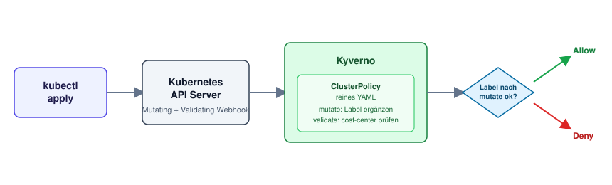
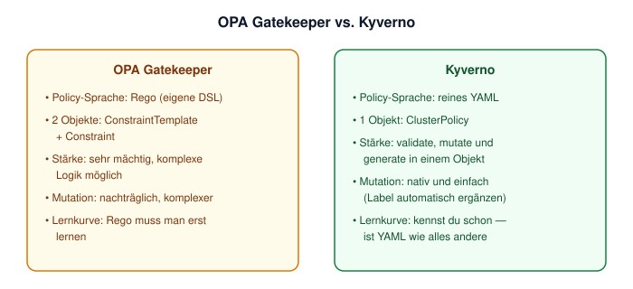

# Kyverno: dieselbe Policy, ohne eine neue Sprache zu lernen

Getestet gegen Kubernetes 1.36 (DOKS, DigitalOcean fra1).

Folge 4 der Serie **Kubernetes Sicherheit**. Letzte Ausgabe: OPA Gatekeeper erzwingt Pflicht-Labels — mächtig, aber du brauchst Rego und zwei Objekte (ConstraintTemplate + Constraint). Kyverno erzwingt dieselbe Regel mit einem einzigen Objekt — in YAML, das du eh schon kannst. Und kann zusätzlich etwas, das Gatekeeper so nicht eingebaut hat: fehlende Labels automatisch ergänzen, statt nur abzulehnen.



## Voraussetzungen

- Laufender Kubernetes-Cluster (DOKS oder jeder andere) mit `kubectl`-Zugriff
- `helm` installiert
- Idealerweise die [Gatekeeper-Übung aus Folge 3](../2026-08-25-opa-gatekeeper/) schon gemacht — für den direkten Vergleich

## Überblick

```
Schritt 1: Kyverno per Helm installieren
Schritt 2: ClusterPolicy — cost-center Pflicht-Label (validate)
Schritt 3: Pod ohne Label deployen — abgelehnt
Schritt 4: Pod mit Label deployen — erlaubt
Schritt 5: Bonus — fehlendes Label automatisch ergänzen (mutate)
Schritt 6: Aufräumen
```

---

## Schritt 1: Kyverno installieren

```bash
helm repo add kyverno https://kyverno.github.io/kyverno/
helm repo update
helm install kyverno kyverno/kyverno \
  --namespace kyverno --create-namespace
```

Prüfen, ob alles läuft:

```bash
kubectl get pods -n kyverno
```

Warten, bis die Kyverno-Pods `Running` sind, bevor es weitergeht.

## Schritt 2: ClusterPolicy — die Regel als reines YAML

Kein Rego, kein zweites Objekt. Eine `ClusterPolicy` reicht:

```yaml
# 01-require-cost-center.yml
apiVersion: kyverno.io/v1
kind: ClusterPolicy
metadata:
  name: require-cost-center-label
spec:
  validationFailureAction: Enforce
  background: true
  rules:
    - name: check-cost-center
      match:
        any:
          - resources:
              kinds:
                - Pod
              namespaces:
                - kyverno-demo
      validate:
        message: "Pflicht-Label 'cost-center' fehlt"
        pattern:
          metadata:
            labels:
              cost-center: "?*"
```

```bash
kubectl create namespace kyverno-demo
kubectl apply -f 01-require-cost-center.yml
```

`pattern` beschreibt, wie das Objekt aussehen muss — `"?*"` heißt "ein beliebiger, nicht-leerer Wert". Kein `ConstraintTemplate`, keine eigene Sprache — nur die Struktur, die du auch sonst in YAML schreibst.

> **Hinweis:** Neuere Kyverno-Versionen (ab 1.19) zeigen beim Apply eine Deprecation-Warnung — `ClusterPolicy` (API-Gruppe `kyverno.io`) wird langfristig durch die CEL-basierten `policies.kyverno.io`-Typen (`ValidatingPolicy`, `MutatingPolicy`, ...) ersetzt. `ClusterPolicy` funktioniert weiterhin und ist noch die verbreitetste, am besten dokumentierte Variante — für den Einstieg hier bewusst genutzt.

## Schritt 3: Pod ohne Label — abgelehnt

```bash
kubectl run blocked-pod --image=nginx:alpine -n kyverno-demo
```

**Erwartete Ausgabe:**

```
Error from server: admission webhook "validate.kyverno.svc-fail" denied the request: 

resource Pod/kyverno-demo/blocked-pod was blocked due to the following policies 

require-cost-center-label:
  check-cost-center: 'validation error: Pflicht-Label ''cost-center'' fehlt. rule check-cost-center failed at path /metadata/labels/cost-center/'
```

## Schritt 4: Pod mit Label — erlaubt

```bash
kubectl run allowed-pod --image=nginx:alpine -n kyverno-demo \
  --labels="cost-center=team-platform"
```

**Erwartete Ausgabe:**

```
pod/allowed-pod created
```

Bis hierhin: exakt dasselbe Ergebnis wie mit Gatekeeper in Folge 3 — nur mit einem Objekt statt zwei, und ohne eine neue Sprache zu lernen.

## Schritt 5: Bonus — Kyverno kann mutieren

Statt nur abzulehnen, kann Kyverno fehlende Labels automatisch ergänzen. Das ist ein `mutate`-Rule — Gatekeeper kann das seit neuerem auch, aber deutlich umständlicher. Bei Kyverno gehört es zum Kern:

```yaml
# 02-default-cost-center.yml
apiVersion: kyverno.io/v1
kind: ClusterPolicy
metadata:
  name: add-default-cost-center
spec:
  rules:
    - name: add-cost-center-if-missing
      match:
        any:
          - resources:
              kinds:
                - Pod
              namespaces:
                - kyverno-demo-mutate
      mutate:
        patchStrategicMerge:
          metadata:
            labels:
              +(cost-center): "unassigned"
```

```bash
kubectl create namespace kyverno-demo-mutate
kubectl apply -f 02-default-cost-center.yml

kubectl run auto-labeled --image=nginx:alpine -n kyverno-demo-mutate
kubectl get pod auto-labeled -n kyverno-demo-mutate --show-labels
```

**Erwartete Ausgabe:**

```
NAME           READY   STATUS    RESTARTS   AGE   LABELS
auto-labeled   1/1     Running   0          3s    cost-center=unassigned,run=auto-labeled,...
```

(Je nach Cloud-Provider können zusätzliche Labels wie eine Region auftauchen — entscheidend ist `cost-center=unassigned`.)

Kein Pod wird abgelehnt — Kyverno ergänzt das fehlende Label selbst, bevor der Pod im Cluster landet. Praktisch für Governance-Regeln, bei denen ein sinnvoller Default reicht, statt jedes Team zur Nachbesserung zu zwingen.

## Schritt 6: Aufräumen

```bash
kubectl delete -f 02-default-cost-center.yml
kubectl delete -f 01-require-cost-center.yml
kubectl delete namespace kyverno-demo kyverno-demo-mutate
helm uninstall kyverno -n kyverno
kubectl delete namespace kyverno
```

---

## Gatekeeper vs. Kyverno im Vergleich



Beide setzen am selben Hebel an — dem Admission-Webhook. Der Unterschied ist, wie viel du dafür neu lernen musst. Wenn dein Team schon YAML schreibt (und wer tut das in Kubernetes nicht), ist die Einstiegshürde bei Kyverno spürbar niedriger. Gatekeeper bleibt die richtige Wahl, wenn die Policy-Logik so komplex wird, dass eine echte Programmiersprache mehr Klarheit bringt als Pattern-Matching in YAML.
